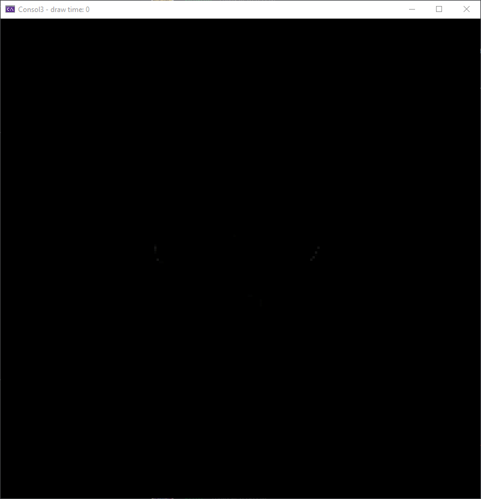
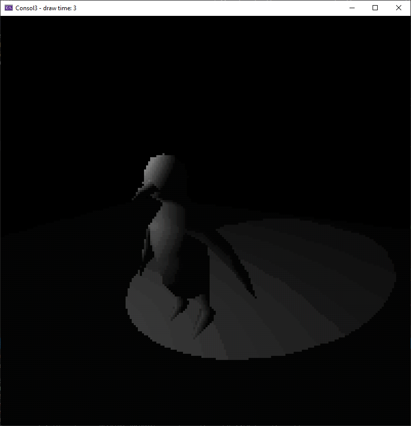

# Consol3
A C++ graphics engine that executes entirely on the CPU

### Intro

###### Software Rendering
Consol3 is a 3d graphics engine that doesn't use the GPU to render any frame, instead the same calculations that would typically be made by the GPU hardware is done in sofware, every single vertex transformation, matrix calculation, etc is programmed on the CPU

###### Windows Console
Consol3 as it stands today is a Windows console application, it uses the console as it's output display, by taking advantage of the console API available in Windows

I have plans to add support for other terminals/platforms, but as of now they are just plans

###### Older Versions
Building this engine is a hobby of mine and I've been working on it infrequently for some years now, as such it has gone through many refactors, partial and complete rewrites, this is the latest version of the engine

###### Rules
No external dependencies will ever be used in this engine, the goal is to do everything using only what the OS already provides, that means no external math libraries, window managers, etc

### Features

###### OBJ file loading  
  

###### Directional lights  
  

###### Point lights  
  

###### Spot lights  
  

###### Diffuse shading  

###### Custom "Renderers"  

###### Textures  
    

###### Fragment Shaders  
  

### Existing Renderers  
###### Greyscale  
Overrides the palette with 16 shades from black to white  
  

###### Dithered Greyscale 
Similar to the previous one, but also takes advantage of the dithering block characters (░▒▓) to dither different combinations of the 16 shades, expands the original 16 to 80 shades  
  

###### Dithered  
Uses the same mechanism from the previous renderer but with the default pallette, giving more depth to the default colors (11 shades per color)  
  

###### Text Only  
Does not use any attribute change, thus the only color is white, the lightness of each pixel is controlled through the character in the cell  

Due to the way the Windows Console renders the character cells, this is currently the fastest renderer (although the one with the least detail), the current characters used are: " ·;%░≡¥▒▓█"  
  

### Planned Features  

* Faster vertex transformations with SIMD  
* ANSI Escape sequence renderer  
* Vertex shaders  
* Faster rasterizer with multipixel filling  
* Faster rasterizer with binning  
* Shadow maps  
* Animations  

