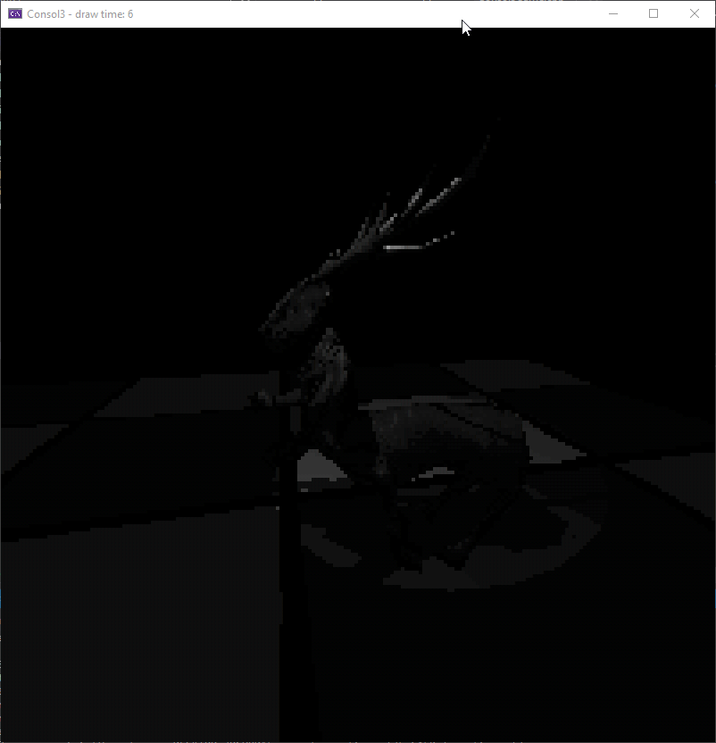

# Consol3
A graphics engine that executes entirely on the CPU and uses the console as the display

## Intro

### Software Rendering
Consol3 is a 3D graphics engine that doesn't use the graphics card to render any frame, instead the same calculations that would typically be made by the GPU hardware is done in software, every single vertex transformation, matrix calculation, etc is calculated on the CPU

To make the engine more flexible, some concepts typically used for programming GPUs are implemented, for example Shaders - However these are still entirely handled on the CPU


### Dependencies
No external dependencies will ever be used in this engine, the goal is to do everything using only what the OS already provides, that means no external math libraries, window managers, resource loaders, etc


#### Older Versions
Building this engine is a hobby of mine, and I've been working on it infrequently for some years now, as such it has gone through many refactors, partial and complete rewrites, this is the latest version of the engine

## Building

This project uses CMake, to build it simply create a build folder on the cloned repository, cd into it and run `cmake ..`, followed by `make` - after compiling 2
executables should be generated inside the build folder:  
    - Consol3_raster  
    - Consol3_voxel  

Consol3_raster will have a scene with only rasterized meshes, lights & other experiments  
Consol3_voxel will have a scene with ray marched voxels, along with a particle-like simulation for sand, water, lava, steam and ice using the voxels  

The project can be built for either Windows or Linux, on Linux no mouse input is supported yet (use the arrow keys to control the look direction), and only a few frame drawers are supported

## Controls

### Raster

Mouse2 and 3 - Control lights

### Voxel

Mouse2 - Spawn currently selected element  
Numbers 1, 2, 3, 4, 5, 6, 7, 8, 9, 0 - Select different elements  
Q and E - Control cursor distance  
R and T - Control cursor size  

### Common for both

WASD - Move  
Capslock - Toggle mouse camera  
Page Up and Down - Change frame drawer  
Arrow keys - Change camera direction  

## Rendering

### Rasterization

The engine has a flexible rasterization pipeline that can be controlled by using different "Shaders", these shaders are similar in concept to GPU shaders, in the sense that they can modify the data that is passed on to the next stage  

The pipeline to render a mesh is as follows:  
    1. The first step of the pipeline is calling the vertex shader for each triangle, giving it the triangle vertices and the mesh transformations, the shader then applies the transformations and projection, and decides whether the triangle should be culled (backface culling)  
    2. Then the resulting triangle is clipped of any offscreen vertices, for this the triangles are clipped against different planes, 2 per each axis  
    3. The resulting vertices from clipping are transformed to screen space and then sent to the rasterizer  
    4. The rasterizer then calculates the coordinates that are inside the triangle and calls the fragment shader for each coordinate  
    5. The fragment shader then decides which color to output on each coordinate, using solid colors, textures, and shading techniques  

The engine uses barycentric rasterization to determine which pixels are inside a triangle  

#### Rasterization Features

###### OBJ file loading  


###### MD2 file loading  


###### Directional lights  


###### Point lights  


###### Spot lights  


###### Textures  


###### Shadow maps  


###### Shadows from multiple sources


###### MD2 Animations
  

###### Ico-sphere generation


###### Normal maps
  

###### Specular highlights


###### Colored lighting


### Ray Marching

The engine also has a different rendering technique based on ray marching instead of rasterization. For this a regular 3D grid is defined, where each cell represents a voxel, and can either be filled with a specific particle type, or empty (Air)

When rendering a frame, rays are marched from the camera origin towards the looking direction, and are stopped in case they hit one of the non-air voxels  

For this ray marching experiment, a simple physics simulation was also implemented, where different elements can be spawned and played around with, the currently supported elements are:  
    - Sand  
    - Ice  
    - Water  
    - Steam  
    - Stone  
    - Lava  
    - Steel  

#### Ray Marching Features

##### Voxel Shading


##### Voxel Shadows


##### Rasterization & Ray Marching on the same scene


##### Physics Simulation


## Frame Drawers  

After rendering a full frame, in order to actually draw to the console output the engine has a flexible system where different "frame drawers" can be used
These are the components in charge of making a specific RGB color pixel be represented in the console

For this, different techniques are employed for different effects/quality, some techniques allow more colors, some allow more performance

##### Greyscale Frame Drawer
Overrides the palette with 16 shades from black to white  
  

###### Dithered Greyscale Frame Drawer
Similar to the previous one, but also takes advantage of the dithering block characters (░▒▓) to dither different combinations of the 16 shades, expands the original 16 to 80 shades  
  

###### Dithered Frame Drawer
Uses the same mechanism from the previous Frame Drawer but with the default palette, giving more depth to the default colors (10 shades per color)  
  

###### VT Escape Sequence Frame Drawer
Uses escape sequences to set the colors of each pixel, allowing for full 32 bit real RGB colors, or indexed colors (256 color palette)  
  

###### Text Only Frame Drawer
Does not use any attribute change, thus the only color is white, the lightness of each pixel is controlled through the character in the cell  
The current characters used are: " ·;%░≡¥▒▓█"  
  


### Shaders
Vertex and Fragment shaders can be created, they are basically classes that implement a vertex and fragment stage in the rasterization pipeline, and can pass data around via the class members

A simple shader:
```cpp
bool PlainShader::VertexShader(Vertex& v0, Vertex& v1, Vertex& v2, const MVPTransform& mvp_mats)
{
	TransformVertexMVP(v0, mvp_mats);
	TransformVertexMVP(v1, mvp_mats);
	TransformVertexMVP(v2, mvp_mats);

	vert_v0_texture_coord = v0.GetTextureCoords();
	vert_v1_texture_coord = v1.GetTextureCoords();
	vert_v2_texture_coord = v2.GetTextureCoords();

	return !IsBackface(v0.GetPosition(), v1.GetPosition(), v2.GetPosition());
}

RGBColor PlainShader::FragmentShader(RGBColor color, const Triangle& triangle, float barcoord0, float barcoord1, float barcoord2)
{
	Vector2 frag_texture_coord = PerspectiveCorrectInterpolate<Vector2>(vert_v0_texture_coord,
									    vert_v1_texture_coord,
									    vert_v2_texture_coord,
									    triangle,
									    barcoord0,
									    barcoord1,
									    barcoord2);

	RGBColor final_color = texture->GetColorFromTextureCoords(frag_texture_coord.x, frag_texture_coord.y);
	final_color.BlendMultiply(color);

	return final_color;
}
```

### Planned Features  

* Faster vertex transformations with SIMD  
* Faster rasterizer with multipixel filling  
* Faster rasterizer with binning  
